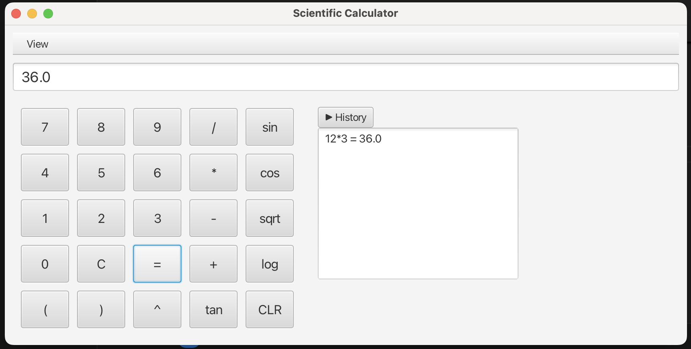

# JavaFX Scientific Calculator

This is a JavaFX-based scientific calculator with a dark mode, keyboard support, and scientific functions.

## Screenshot



## ✨ Features

- Basic arithmetic operations
- Scientific functions: sin, cos, tan, log, ln, sqrt
- Dark mode toggle
- Keyboard input support
- Operation history with toggle and clear button
- Copy result to clipboard
- Error highlighting for invalid expressions

## 🛠 Build Instructions (Mac)

Make sure Maven and JavaFX are installed. Then run:

```bash
mvn clean package
java --module-path /path/to/javafx-sdk-24.0.1/lib \
     --add-modules javafx.controls,javafx.fxml \
     -cp "target/CalculatorApp-1.0-SNAPSHOT.jar:target/lib/*" \
     com.calculator.CalculatorApp
